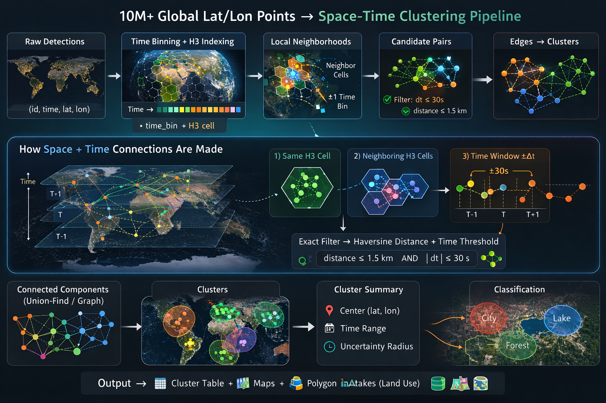

# Space-Time Cluster Repo (Unix Seconds)



This repo clusters large geospatial detection sets using:

- `time` as **unix seconds stored as float64**
- H3 for global coarse partitioning
- exact haversine distance for final pair filtering
- optional per-point neighbor-count filtering
- connected components for final cluster labels
- optional GeoPandas classification against city/lake layers

## Repo layout

- `src/space_time_cluster/` - package code
- `src/space_time_cluster/pipeline.py` - top-level pipeline orchestration
- `src/space_time_cluster/graph.py` - graph building, neighbor filtering, and connected components
- `src/space_time_cluster/spatial.py` - H3 helpers and haversine distance utilities
- `src/space_time_cluster/time_utils.py` - unix-second to microsecond conversion and time binning
- `src/space_time_cluster/summary.py` - cluster summary generation
- `src/space_time_cluster/classification.py` - optional polygon classification against city/lake layers
- `src/space_time_cluster/io.py` - parquet loading and output directory helpers
- `scripts/run_pipeline.py` - CLI entrypoint
- `scripts/make_mock_detections.py` - create mock detection parquet
- `scripts/prepare_global_cities.py` - prepare global city vector data for the pipeline
- `scripts/prepare_water_land.py` - convert water/land vector layers into simplified parquet point datasets
- `scripts/visualize_detections.py` - plot clustered detections with centroids, ellipses, and nearby cities/lakes
- `scripts/visualize_detection.py` - older inspection-oriented helper conversions
- `scripts/kalman_filter_playground.py` - interactive single-satellite azimuth/elevation Kalman filter dashboard
- `configs/example_config.json` - sample config
- `tests/` - unit tests for time, spatial, graph, I/O, and summary helpers

## Install

Base install:

```bash
python -m pip install -e .
```

Geo extras:

```bash
python -m pip install -e ".[geo]"
```

The `geo` extra now also includes the interactive dashboard stack used by the plotting tools:

- `hvplot`
- `holoviews`
- `bokeh`
- `panel`

Test extras:

```bash
python -m pip install -e ".[test]"
```

Local virtual environment example:

```bash
python3 -m venv .venv
.venv/bin/pip install -e ".[test]"
```

## Running each script

### `scripts/make_mock_detections.py`

This creates a parquet file with columns:

- `id`
- `time` (unix seconds as float64)
- `lat`
- `lon`

```bash
python scripts/make_mock_detections.py --output data/detections.parquet
```

Optional arguments:

- `--seed` to make the generated dataset reproducible
- `--noise-points` to change the amount of global background noise

Example:

```bash
python scripts/make_mock_detections.py \
  --output data/detections.parquet \
  --seed 42 \
  --noise-points 1500
```

### `scripts/run_pipeline.py`

```bash
python scripts/run_pipeline.py --config configs/example_config.json
```

Outputs land in `out/` by default:

- `point_assignments.parquet`
- `cluster_summary.parquet`
- `cluster_city_hits.parquet` when `city_vector_path` is configured
- `cluster_lake_hits.parquet` when `lake_vector_path` is configured

### `scripts/prepare_global_cities.py`

This script has two subcommands:

- `geonames` for GeoNames zip inputs
- `naturalearth` for Natural Earth populated places vector inputs

If you want city data for the pipeline or the visualization script, use one of these two flows.

#### City Data: GeoNames

This is the most direct way to generate `data/cities_global.gpkg` and `data/cities_global.parquet`.

1. Download a GeoNames archive:

```bash
mkdir -p data/raw

wget -O data/raw/cities500.zip \
  http://download.geonames.org/export/dump/cities500.zip
```

Larger alternatives if you want more coverage:

```bash
wget -O data/raw/cities1000.zip \
  http://download.geonames.org/export/dump/cities1000.zip

wget -O data/raw/cities15000.zip \
  http://download.geonames.org/export/dump/cities15000.zip

wget -O data/raw/allCountries.zip \
  http://download.geonames.org/export/dump/allCountries.zip
```

2. Build the prepared city outputs:

```bash
python scripts/prepare_global_cities.py geonames \
  --input data/raw/cities500.zip \
  --out-base data/cities_global \
  --min-population 1000 \
  --h3-res 7
```

This writes:

- `data/cities_global.parquet`
- `data/cities_global.gpkg`
- optionally `data/cities_global.gdb` if your GDAL build supports writing FileGDB

#### City Data: Natural Earth

Use this if you prefer the Natural Earth populated places dataset.

1. Download and unzip the source data:

```bash
mkdir -p data/raw data/unpacked

wget -O data/raw/ne_10m_populated_places.zip \
  https://naciscdn.org/naturalearth/10m/cultural/ne_10m_populated_places.zip

unzip -o data/raw/ne_10m_populated_places.zip -d data/unpacked/ne_10m_populated_places
```

2. Build the prepared city outputs:

```bash
python scripts/prepare_global_cities.py naturalearth \
  --input data/unpacked/ne_10m_populated_places/ne_10m_populated_places.shp \
  --out-base data/cities_global \
  --min-scalerank 8 \
  --h3-res 7
```

This also writes:

- `data/cities_global.parquet`
- `data/cities_global.gpkg`
- optionally `data/cities_global.gdb`

The script always writes:

- `*.parquet`
- `*.gpkg`

It also attempts to write `*.gdb` using the GDAL `OpenFileGDB` driver if your environment supports writing that format. Many Python/GDAL builds can read `.gdb` but cannot write it. When write support is missing, the script prints a message and still gives you `.parquet` and `.gpkg`.

### `scripts/prepare_water_land.py`

This script now exposes a CLI with two subcommands:

- `lakes`
- `land`

If you keep your source files in the default repo locations, you can run it without extra arguments:

```bash
python scripts/prepare_water_land.py lakes
python scripts/prepare_water_land.py land
```

Default paths:

- `lakes` input: `data/unpacked/HydroLAKES_polys_v10_shp/HydroLAKES_polys_v10.shp`
- `lakes` output: `data/lakes.parquet`
- `land` input: `data/unpacked/ne_10m_land/ne_10m_land.shp`
- `land` output: `data/land_points.parquet`

#### Lake Data: HydroLAKES

If you want lake inputs for visualization or classification, use this flow:

1. Download and unzip HydroLAKES:

```bash
mkdir -p data/raw data/unpacked

wget -O data/raw/HydroLAKES_polys_v10_shp.zip \
  https://data.hydrosheds.org/file/HydroLAKES/HydroLAKES_polys_v10_shp.zip

unzip -o data/raw/HydroLAKES_polys_v10_shp.zip -d data/unpacked/HydroLAKES_polys_v10_shp
```

2. Either use the raw polygon shapefile directly in visualization:

```bash
--lake-path data/unpacked/HydroLAKES_polys_v10_shp/HydroLAKES_polys_v10.shp
```

or build the prepared centroid parquet:

```bash
python scripts/prepare_water_land.py lakes \
  --input data/unpacked/HydroLAKES_polys_v10_shp/HydroLAKES_polys_v10.shp \
  --output data/lakes.parquet
```

That writes:

- `data/lakes.parquet`

#### Land Data: Natural Earth

If you want offline land context for `visualize_detections.py`, download the Natural Earth land polygons:

```bash
mkdir -p data/raw data/unpacked

wget -O data/raw/ne_10m_land.zip \
  https://naciscdn.org/naturalearth/10m/physical/ne_10m_land.zip

unzip -o data/raw/ne_10m_land.zip -d data/unpacked/ne_10m_land
```

You can then point the visualization script at:

```bash
--land-path data/unpacked/ne_10m_land/ne_10m_land.shp
```

You can also override the defaults:

```bash
python scripts/prepare_water_land.py lakes \
  --input data/unpacked/HydroLAKES_polys_v10_shp/HydroLAKES_polys_v10.shp \
  --output data/lakes.parquet
```

```bash
python scripts/prepare_water_land.py land \
  --input data/unpacked/ne_10m_land/ne_10m_land.shp \
  --output data/land_points.parquet
```

#### Convert lakes to centroid parquet records

Use `scripts/prepare_water_land.py` when you want one parquet row per lake with centroid coordinates:

```python
from scripts.prepare_water_land import convert_lakes

convert_lakes(
    input_path="data/unpacked/HydroLAKES_polys_v10_shp/HydroLAKES_polys_v10.shp",
    output_parquet="data/lakes.parquet",
)
```

This writes a parquet file with lake name, centroid latitude/longitude, area, and a `type` column.

#### Convert land polygons to sampled point parquet records

Use `scripts/prepare_water_land.py` when you want a coarse grid of points that fall on land:

```python
from scripts.prepare_water_land import convert_land

convert_land(
    input_path="data/unpacked/ne_10m_land/ne_10m_land.shp",
    output_parquet="data/land_points.parquet",
)
```

This is a simplified approximation intended for quick classification or inspection workflows rather than precise polygon containment analysis.

### `scripts/visualize_detections.py`

This script renders an interactive `hvplot` visualization of clustered detections, cluster centroids, covariance-based ellipses, and nearby cities/lakes.

It now defaults to an offline-friendly view so the output does not depend on a remote tile server. That avoids the `403` tile-overlay failures you can get from some map providers.

Basic usage:

```bash
python scripts/visualize_detections.py
```

With the default settings, the script:

- reads `out/point_assignments.parquet`
- reads `out/cluster_summary.parquet`
- tries to use `data/unpacked/ne_10m_land/ne_10m_land.shp` as an optional local land layer
- tries to use `data/cities_global.gpkg` or `data/cities_global.parquet` if present
- tries to use `data/lakes.parquet` or `data/unpacked/HydroLAKES_polys_v10_shp/HydroLAKES_polys_v10.shp` if present
- writes `images/detection_clusters.html`
- uses `--basemap none` by default

What the plot shows:

- clustered detections with larger high-contrast markers
- cluster centroids
- cluster ellipses
- nearby city markers and labels
- nearby lake labels and polygon outlines when the source layer has polygons
- optional land polygons and a global graticule when no remote basemap is used

Useful arguments:

- `--assignments` to point at a different `point_assignments.parquet`
- `--summary` to point at a different `cluster_summary.parquet`
- `--output` to control the HTML output path
- `--land-path` to provide a local land polygon layer for offline world context
- `--city-path` to overlay nearby city data
- `--lake-path` to overlay nearby lake data
- `--nearby-radius-km` to expand the search radius around each cluster
- `--max-clusters` to plot only the largest `N` clusters
- `--hide-noise` to suppress unclustered detections
- `--basemap` to choose a background style

Available basemap values:

- `none`
- `osm`
- `cartolight`
- `cartodark`
- `esriimagery`
- `esristreet`
- `esriterrain`
- `opentopo`

Basemap differences:

- `none`: no remote tiles; uses your own overlays plus offline context from the script. Most reliable choice when you want to avoid `403` or access-blocked tile requests.
- `osm`: OpenStreetMap street-style map. Good general city and road context, but can look busy under dense detection overlays.
- `cartolight`: light, minimal street/reference map. Usually the clearest remote basemap for analytics-style overlays.
- `cartodark`: dark version of the Carto reference map. Useful when you want bright overlays to stand out strongly.
- `esriimagery`: satellite/aerial imagery. Best when you want visual ground context such as coastlines, urban footprint, farmland, or terrain appearance.
- `esristreet`: ESRI street/reference map. Similar purpose to `osm`, with different cartographic styling.
- `esriterrain`: terrain-focused basemap. Better for physical geography and relief than for roads or urban detail.
- `opentopo`: topographic map. Best when elevation and terrain interpretation matter more than roads.

Practical recommendation:

- use `none` if reliability matters most
- use `cartolight` if you want a clean map background
- use `esriimagery` if you want to inspect what the detections are physically near on the Earth

Where the visualization inputs come from:

- `--assignments`: produced by `python scripts/run_pipeline.py --config ...`
  output file: `out/point_assignments.parquet`
- `--summary`: produced by `python scripts/run_pipeline.py --config ...`
  output file: `out/cluster_summary.parquet`
- `--land-path`: typically downloaded from Natural Earth land polygons, then unzipped locally
  download: `https://naciscdn.org/naturalearth/10m/physical/ne_10m_land.zip`
  default local file: `data/unpacked/ne_10m_land/ne_10m_land.shp`
- `--city-path`: typically produced by `scripts/prepare_global_cities.py`
  source downloads:
  `http://download.geonames.org/export/dump/cities500.zip`
  `http://download.geonames.org/export/dump/allCountries.zip`
  `https://naciscdn.org/naturalearth/10m/cultural/ne_10m_populated_places.zip`
  typical local outputs:
  `data/cities_global.gpkg`
  `data/cities_global.parquet`
- `--lake-path`: typically comes from HydroLAKES
  download: `https://data.hydrosheds.org/file/HydroLAKES/HydroLAKES_polys_v10_shp.zip`
  raw polygon file:
  `data/unpacked/HydroLAKES_polys_v10_shp/HydroLAKES_polys_v10.shp`
  optional prepared centroid parquet from `scripts/prepare_water_land.py`:
  `data/lakes.parquet`
- `--output`: written by the visualization script itself
  typical file: `images/detection_clusters.html`

Recommended offline-safe example:

```bash
python scripts/visualize_detections.py \
  --assignments out/point_assignments.parquet \
  --summary out/cluster_summary.parquet \
  --land-path data/unpacked/ne_10m_land/ne_10m_land.shp \
  --city-path data/cities_global.gpkg \
  --lake-path data/unpacked/HydroLAKES_polys_v10_shp/HydroLAKES_polys_v10_shp/HydroLAKES_polys_v10.shp \
  --basemap none \
  --output images/detection_clusters.html \
  --nearby-radius-km 50 \
  --max-clusters 10
```

If you want a remote map tile background instead, select one explicitly:

```bash
python scripts/visualize_detections.py \
  --basemap cartolight \
  --output images/detection_clusters.html
```

If your city dataset contains points instead of polygons, the script will draw city markers and labels rather than polygon outlines. Lake polygons are drawn when polygon geometry is available.

### `scripts/kalman_filter_playground.py`

This script runs a local `Panel` dashboard for exploring a constant-position Kalman filter driven by azimuth/elevation observations from a single satellite.

Install the plotting dependencies first:

```bash
python -m pip install -e ".[geo]"
```

Run the dashboard:

```bash
python scripts/kalman_filter_playground.py --show
```

Or bind it to a specific port:

```bash
python scripts/kalman_filter_playground.py --port 5007 --show
```

The dashboard lets you change:

- satellite latitude, longitude, and altitude
- target starting latitude and longitude
- target east and north velocity
- random target wander
- azimuth and elevation noise
- Kalman process noise variance
- Kalman measurement noise variance
- random seed

What you will see:

- an `OSM` basemap with true, measured, and filtered tracks
- innovation, uncertainty, and tracking error over time
- measured azimuth and elevation over time
- a summary table including filtered error and visibility fraction

Important geometry note:

- if the target falls below the satellite horizon, the azimuth/elevation ray still intersects the Earth, but it intersects the near side of the globe instead of the intended target location
- the dashboard reports this through a visibility note and `visible_fraction`

## End-to-end mock example

This is a complete local example that:

1. generates mock detections
2. runs the clustering pipeline
3. renders the interactive cluster visualization with offline world context and nearby cities

```bash
.venv/bin/python scripts/make_mock_detections.py \
  --output data/detections.parquet \
  --seed 42 \
  --noise-points 1000

.venv/bin/python scripts/run_pipeline.py \
  --config configs/example_config.json

.venv/bin/python scripts/visualize_detections.py \
  --assignments out/point_assignments.parquet \
  --summary out/cluster_summary.parquet \
  --land-path data/unpacked/ne_10m_land/ne_10m_land.shp \
  --output images/detection_clusters.html \
  --city-path data/cities_global.gpkg \
  --lake-path data/unpacked/HydroLAKES_polys_v10_shp/HydroLAKES_polys_v10_shp/HydroLAKES_polys_v10.shp \
  --basemap none \
  --nearby-radius-km 100 \
  --max-clusters 10
```

Expected outputs:

- `data/detections.parquet`
- `out/point_assignments.parquet`
- `out/cluster_summary.parquet`
- `images/detection_clusters.html`

### `scripts/visualize_detection.py`

This older helper file still exposes the conversion helpers from `scripts/prepare_water_land.py` for import-based use:

```python
from scripts.visualize_detection import convert_lakes, convert_land

convert_lakes("path/to/lakes.shp", "data/lakes.parquet")
convert_land("path/to/land.shp", "data/land_points.parquet")
```

Use it the same way via Python import if you want a lightweight inspection-oriented scratch utility module.

## Pipeline notes

### Time handling

The pipeline assumes source `time` values are **unix seconds as float**. Internally it converts them to integer microseconds for stable threshold checks and binning.

### Neighbor-count filter

If enabled:

- build valid space-time edges
- count neighbors from that edge list
- remove points with fewer than `min_neighbors`
- run connected components on the filtered graph

This is optional and is controlled by:

- `use_neighbor_count_filter`
- `min_neighbors`

### Cluster-size filter

A final connected component must still have at least `min_cluster_size` points to survive.

## Example config fields

- `start_time`, `end_time`: unix seconds as float
- `time_bin_seconds`: coarse time buckets
- `max_time_delta_s`: exact pairwise time threshold
- `max_distance_m`: exact pairwise spatial threshold
- `h3_res`: H3 resolution for coarse spatial partitioning
- `use_neighbor_count_filter`, `min_neighbors`: optional support filter before connected components
- `min_cluster_size`: final minimum connected-component size
- `guard_band_m`, `radius_quantile`: cluster radius summary controls
- `city_vector_path`, `lake_vector_path`: optional polygon layers for cluster classification
- `kf_process_noise_var_m2`, `kf_measurement_noise_var_m2`: constant-position Kalman filter parameters used when computing per-cluster tracking features

## Package usage

You can also call the pipeline directly from Python:

```python
from space_time_cluster.config import load_config
from space_time_cluster.pipeline import run_pipeline

cfg = load_config("configs/example_config.json")
run_pipeline(cfg)
```

The package code is split by responsibility, so lower-level helpers can also be imported independently for custom workflows and targeted tests.

## Testing

```bash
.venv/bin/pytest
```

If you do not use a local virtual environment, `pytest` also works after installing the test extras into your current Python environment.
